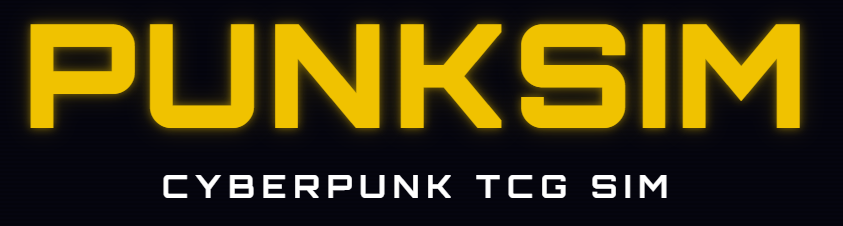

Note: This repo is a push from PUNKSIM/engine folder. There is no GIT history. PR's will not work, please raise an issue instead.

# Open Punksim Core Engine Stepper

PUNKSIM is an unofficial simulation of the Cyberpunk Trading Card Game. 

Game is live at https://punksim.net

Companion SDK (bots + CLI runner): [cyber-sim-sdk](https://github.com/orzdk/cyber-sim-sdk)

## Core Engine

Rules engine and card data for the Cyberpunk TCG simulator (PUNKSIM).

The engine takes a board state and a player action, returns the new board
state plus the next halt (what choice the engine is waiting on). 

## Quick start

The engine ships without bots — grab one from the companion SDK
(`cyber-sim-sdk`). Clone both side-by-side:

```bash
git clone https://github.com/orzdk/cyber-sim-engine
git clone https://github.com/orzdk/cyber-sim-sdk
```

`runtime/play.js` runs a full game between two bots — no server, no HTTP —
and prints the winner:

```bash
cd cyber-sim-engine
node runtime/play.js \
  --deck1 decks/JUN06_RRG_Arasaka_Onslaught.deck \
  --deck2 decks/JUN06_BBY_Voodoo_Heist.deck
```

Windows: double-click `runtime/play.bat`.

Flags:
- `--bot1 <path>` / `--bot2 <path>` — bot file paths
- `--first p1|p2` — pin starting player (default random)
- `--turn-cap N` — abort runaway games (default 200)
- `--step-cap N` — abort a game stuck inside one turn (default 10000). A loop that
  never advances `turn_number` is invisible to `--turn-cap`; both report as errors.
- `--runcount N` — play N games and aggregate stats (default 1)
- `--seed N` — integer seed for the mulberry32 PRNG (also pins first player deterministically)
- `--trace` — dump engine trace to stdout (single-game only)

Every run also writes first game to `runtime/play.trace.jsonl`. The format is described in
**Walkthrough** below. If you need more statistics, you need to implement in play.js. 

---

## Walkthrough

This section walks through the first three exchanges of an actual game,
straight out of `runtime/play.trace.jsonl`. It's the quickest way to see
the protocol end-to-end before reading the reference.

### Step 1 — engine prompts p1 to pick a fixer die

Right after `setupGame`, the engine fires the first `step()` and immediately
halts because p1 has rollable dice in their fixer zone. The bot sees:

```json
{
  "kind": "recv", "n": 1, "turn": 1, "phase": "ready", "owner": "p1",
  "waitingFor": {
    "step": "choose_gig_die",
    "owner": "p1",
    "available": [4, 6, 8, 10, 12]
  },
  "board": { /* full game state */ }
}
```

**What the bot evaluates:** `waitingFor.step` tells the bot the question
shape; `waitingFor.available` lists the legal answers (one of the d4 / d6 /
d8 / d10 / d12 in p1's `zones.fixer`). The bot reads its own hand from
`board.p1.zones.hand`, its legends from `board.p1.zones.legends`, etc.

**What the bot sends back:**

```json
{
  "kind": "send", "n": 1, "owner": "p1",
  "action": { "step": "choose_gig_die", "sides": 4 },
  "source": "bot"
}
```

The action object's `step` always matches the prompt's `step`. The bot picks
the d4. Engine rolls it, moves the rolled die from `zones.fixer` to
`zones.gigs`, and fires the next halt.

### Step 2 — engine prompts p1 to take a main-phase action

```json
{
  "kind": "recv", "n": 2, "turn": 1, "phase": "main", "owner": "p1",
  "waitingFor": {
    "step": "main_phase",
    "owner": "p1",
    "spend_activatable_iids": [],
    "attackable": []
  }
}
```

The board has changed — `p1.zones.gigs` now contains the d4 that was rolled
(`{ iid: "p1_d4", sides: 4, value: 1, origin_pid: "p1" }`), `p1.zones.fixer`
is one die shorter, and `p1.took_gig_this_turn = true`.

`spend_activatable_iids` lists `spend_activated` abilities the bot can
trigger right now — empty here because no asset is in play yet.

**What the bot evaluates:** which (if any) card to play, resource to tap,
legend to call, unit to attack with, or whether to end the turn. The minimum
bot picks "end turn" immediately:

```json
{
  "kind": "send", "n": 2, "owner": "p1",
  "action": { "step": "end_turn" },
  "source": "bot"
}
```

Control swaps to p2. (On turn 1, `attackable` is empty anyway — attacks are
only available from turn 3 on.)

### Step 3 — engine prompts p2 to pick a fixer die

```json
{
  "kind": "recv", "n": 3, "turn": 2, "phase": "start", "owner": "p2",
  "waitingFor": {
    "step": "choose_gig_die",
    "owner": "p2",
    "available": [4, 6, 8, 10, 12]
  }
}
```

`board.turn_number` is now 2, `board.active_player` is `"p2"`. The driver
notices `waitingFor.owner === "p2"` and routes the next `selectAction` call
to bot2 instead of bot1.

### The pattern

Every exchange follows the same shape:

1. Engine returns `{ board, waitingFor }`.
2. Driver dispatches to `bots[waitingFor.owner].selectAction(waitingFor, board)`.
3. Bot returns an action object whose `step` matches `waitingFor.step` (or
   matches the expected response shape for the halt — see **Reference §6** below).
4. Driver calls `step(board, action)` → new `{ board, waitingFor }`.
5. Loop until `board.winner` is set.

Bot fallbacks: if `selectAction` returns `null`, the driver auto-fills safe
defaults for `main_phase` (`end_turn`), `defensive_step` (`pass_defensive`),
and `attacker_interrupt_step` (`pass_attacker_interrupt`). For any other halt
(notably `effect_choice`), returning `null` is a bot bug — the bot must
implement the response.

### Reading the trace file

`runtime/play.trace.jsonl` is one JSON object per line:

| `kind` | Meaning |
|---|---|
| `config` | First line — bots, decks, firstPlayer, runcount, turnCap |
| `recv` | What the bot received: `n`, `turn`, `phase`, `owner`, `waitingFor`, `board` |
| `send` | What the bot sent: `n`, `owner`, `action`, `source` (`"bot"` or `"fallback"`) |
| `error` | Halt the bot couldn't handle (engine throw, no fallback, etc.) |
| `game_end` | Last line — winner, turns, steps, error |

## Public API

```js
const { setupGame, step, validateDeck, evalExpr,
        cleanBoardForExternal, disableTrace, defaultPassAction,
        CARDS, CARD_SCRIPTS, CHOICE_TYPES } = require('cyber-sim-engine');
```

- `setupGame(deckA, deckB, firstPlayer, opts?)` — build a fresh game.
  Returns the initial board. `firstPlayer` is `'p1'` or `'p2'`.
  `opts.seed` (optional integer) seeds the mulberry32 PRNG — same seed + same
  action sequence produces an identical game.
  `opts.preShuffled` (optional) lets a caller supply pre-shuffled decks +
  legends (used by the replayer).
- `step(board, action)` — advance one step. Returns
  `{ status, board, waitingFor }` where `status` is `'waiting'` or
  `'ended'`; `waitingFor` is `null` when `status === 'ended'`.
- `validateDeck(deckDef)` — check deck legality. Returns
  `{ errors, warnings, total }`. A deck is legal when `errors.length === 0`.
- `evalExpr(expr, board, ctx)` — evaluate a card-script expression against a
  board state (used for cost modifiers, conditional triggers, etc.).
- `cleanBoardForExternal(board)` — return a shallow copy of `board` with
  engine-internal fields stripped (`_trace`, `_rngMap`, `_rng_seq`, `_rngState`),
  for handing to clients / serializers.
- `disableTrace(board)` — set `board._trace = null` so subsequent `trace()`
  calls are no-ops. Useful for high-throughput batch runs (the arena worker
  enables this automatically).
- `defaultPassAction(waitingFor)` — safe-default action for a given
  `waitingFor`. Returns an action object or `null`. The driver in
  `runtime/play.js` uses this when a bot returns `null`.
- `CARDS` / `CARD_SCRIPTS` — arrays of card definitions and script
  definitions. Build your own `card_id` → entry index if you need O(1)
  lookup; the package doesn't ship a pre-built map.
- `CHOICE_TYPES` — spec of all halt kinds with display hints.

## Determinism and replay

Engine randomness flows through a single internal function `randFloat(b, tag)`.
It has three modes:

**Default (non-deterministic)** — no RNG fields set on the board → uses
`Math.random()`. Fine for one-off play; not reproducible.

**Seeded PRNG** — pass `opts.seed` to `setupGame` (or set `board._rngState`
directly before calling `step`). The engine runs a mulberry32 PRNG seeded by
that value. Same seed + same action sequence = identical game every time. The
`--seed N` flag on `runtime/play.js` exercises this path.

```js
const { board } = step(setupGame(d1, d2, 'p1', { seed: 42 }), undefined);
```

**Named map** — set `board._rngMap = {}` before playing. The engine writes
each named outcome into the map as it goes (`tag → float`). To replay, set
that same map on a fresh board; `randFloat` returns the recorded value instead
of rolling again. Tags are stable across engine versions for the same sequence
of actions, so this is load-bearing for snapshot/replay systems.

```js
// record
board._rngMap = {};
// ... play game; board._rngMap accumulates { 'd.p1_d4.t1': 0.73, ... }

// replay
replayBoard._rngMap = { ...recordedMap };
// engine consumes named values instead of rolling fresh
```

## Testing

The test suite lives in the upstream repo at
[github.com/orzdk/cyber-sim](https://github.com/orzdk/cyber-sim) under
`server/test/`. The engine is verified by the author against the full card
pool before each release.

## License

MIT. See `LICENSE`.

---

# Reference

Flat reference for everything the public API exposes — board, halt protocol,
card-script DSL, evaluators. Every fact is read directly from source; if
behavior drifts from this doc, the source wins.

## 1. Entry Point

`step(board, input)` — exported from the package root (`require('cyber-sim-engine').step`).

- Always deep-clones the incoming board before mutating.
- Returns `{ status: 'waiting', board, waitingFor }` or `{ status: 'ended', board, waitingFor: null }`.
- Card data (`cards.json` / `card_scripts.json`) is bundled and deep-frozen; the
  engine reads it internally — callers never pass it. `CARDS` / `CARD_SCRIPTS`
  are exported for the caller's own lookups (bots, UI).

---

## 2. Board Shape

Produced by `createBoard()` and `setupGame()`.

```
board = {
  p1: PlayerState,
  p2: PlayerState,
  turn_number: 0,
  active_player: 'p1' | 'p2',
  first_player:  'p1' | 'p2',
  phase: 'between_turns' | 'start' | 'main',
  current_attack: null | AttackState,
  effect_stack:   [],
  scheduled_effects: [],
  rate_limits: { p1: {}, p2: {} },
  overtime: false,
  winner: null | 'p1' | 'p2',
  _next_iid: 1,
  _trace: [],
}
```

### PlayerState

```
{
  id: 'p1' | 'p2',
  zones: Zones,
  called_legend_this_turn: false,
  sold_card_this_turn: false,
  called_legend_defensive_this_turn: false,
  tapped: [],              // iids of resources tapped but not yet spent
  took_gig_this_turn: false,
}
```

### Zones

```
{
  hand:    [CardRef],
  deck:    [CardRef],
  trash:   [CardRef],
  removed: [CardRef],
  legends: [LegendRef],
  eddies:  [EddieRef],
  field:   [UnitRef],
  fixer:   [Fixer],        // 6 entries: d4,d6,d8,d10,d12,d20
  gigs:    [GigRef],
}
```

### Ref shapes

**CardRef** (hand / deck / trash / removed): `{ iid, card_id }`

**UnitRef** (field):
```
{ iid, card_id, state: 'ready'|'spent', equipped_gear: [GearRef],
  entered_play_turn: number,
  _temp_power?: number, _temp_keywords?: string[], _peeked?: true }
```

**LegendRef** (legends):
```
{ iid, card_id, state: 'ready'|'spent', face: 'face_up'|'face_down',
  equipped_gear: [GearRef] }
```

**GearRef** (inside `equipped_gear`): `{ iid, card_id }`

**EddieRef** (eddies, created when a card is sold): `{ iid, card_id, state: 'ready'|'spent' }`

**GigRef** (gigs / fixer):
```
{ iid, sides: 4|6|8|10|12|20, value: number, origin_pid: 'p1'|'p2' }
```
Fixer starts as `{ iid: '<pid>_d<sides>', sides, value: 0 }` without origin_pid.

---

## 3. setupGame Initial State

- Both decks shuffled; both hands deal `OPENING_HAND_SIZE` (6) cards from top of deck.
- Legends shuffled, all start `face_down`, `state: 'ready'`.
- First player starts with `legends[0]` and `legends[1]` in `state: 'spent'`.
- `turn_number` = 0; phase = `'between_turns'`.
- `_next_iid` starts at 1 and increments for every new game object.

---

## 4. Phase Flow

```
between_turns
  └─ beginTurn()
       ├─ turn_number += 1
       ├─ win/deckout check
       ├─ readyAll (turn 2+ only) + draw card
       ├─ if fixer has non-d20 dice → phase='start', waitingFor: choose_gig_die
       └─ else → phase='main', fires OnPlayPhaseStart, waitingFor: main_phase

start
  └─ stepStart()
       ├─ input: choose_gig_die → rolls die, pushes to gigs, removes from fixer
       └─ → phase='main', fires OnPlayPhaseStart, waitingFor: main_phase

main
  └─ stepMain()  (play and attack interleave freely)
       ├─ input: tap_resource | untap_resource | sell_card | call_legend | play_card
       │    all return waitingFor: main_phase
       ├─ input: declare_attack (turn 3+) → declares, fires OnCardAttacks, waitingFor: defensive_step
       │    combat resolves → back to waitingFor: main_phase
       ├─ input: end_turn | null → endTurn() → next player's turn
       ├─ defensive_step: blocker | call_legend_defensive | pass_defensive
       ├─ choose_gig_to_steal → handleStealChoice
       └─ effect_choice_response → resume, dispatch by pending_resume
```

---

## 5. waitingFor Objects

All include `{ step, owner }`. `owner` is the pid that must act.

### `choose_gig_die`
```js
{ step: 'choose_gig_die', owner, available: [4|6|8|10|12|20, ...] }
```
Available = non-d20 fixer sides if any; falls back to [20] if only d20 remains.

### `main_phase`
```js
{ step: 'main_phase', owner,
  spend_activatable_iids: [{ iid, card_id, ability_idx, kind, host_iid?, prompt? }, ...],
  attackable: [iid, ...],
  must_attack_iids: [iid, ...] }
```
`spend_activatable_iids` lists Anytime `spend_activated` abilities the owner can fire right now.
`attackable` = iids of ready units that `canUnitAttack()` (empty before turn 3). Plays and attacks
interleave freely; `declare_attack` is one of the available actions (see §6) and combat returns here.
`must_attack_iids` = compelled units (`CompelAttack`); `end_turn` is rejected while one of them
can still legally attack.

### `attacker_interrupt_step`
```js
{ step: 'attacker_interrupt_step', owner,
  attacker_iid, target,
  interrupt_castable_iids: [iid, ...],
  interrupt_spendable_iids: [{ iid, card_id, ability_idx, ... }, ...] }
```
Fired after `declare_attack` when the attacker has interrupt cards in hand or spend-activated abilities reacting to `OnCardAttacks`.

### `defensive_step`
```js
{ step: 'defensive_step', owner, attacker_iid, target,
  can_call_legend: bool, blocker_iids: [iid, ...],
  interrupt_castable_iids: [iid, ...],
  interrupt_spendable_iids: [{ iid, card_id, ability_idx, ... }, ...] }
```
`blocker_iids` = ready units with BLOCKER keyword; blocking spends the chosen unit
(firing `OnSpent`), so it cannot block again that turn. Empty if the attacker is currently
UNBLOCKABLE — computed live each time this step renders (covers mid-attack Street Cred
changes) and applies to both gig and unit attacks. `interrupt_castable_iids` = quick
Programs the defender can cast at normal cost; `interrupt_spendable_iids` = quick
spend-activated abilities offered as a reaction.

### `choose_gig_to_steal`
```js
{ step: 'choose_gig_to_steal', owner, available_iids: [iid, ...], count: n }
```

### `effect_choice`
```js
{ step: 'effect_choice', owner, choice_needed: ChoiceNeeded }
```

---

## 6. Input Shapes

### choose_gig_die
```js
{ step: 'choose_gig_die', sides: 4|6|8|10|12|20 }
```

### main_phase actions
```js
{ step: 'tap_resource',          iid }       // toggles — second tap untaps
{ step: 'untap_resource',        iid }       // explicit untap (no-op if not tapped)
{ step: 'sell_card',             iid }       // card must have card.eddie truthy
{ step: 'call_legend',           iid }       // costs 1 tapped resource
{ step: 'play_card',             iid, equip_to? }  // equip_to required for Gear type
{ step: 'play_legend_solo',      iid }       // play a face-up GO_SOLO legend as a unit
{ step: 'activate_anytime_spend', iid, ability_idx }  // fire a spend_activated ability
{ step: 'declare_attack', attacker_iid, target: { kind: 'gigs' } }              // attack the Gig area (steal)
{ step: 'declare_attack', attacker_iid, target: { kind: 'unit', iid: targetIid } } // attack a spent unit
{ step: 'end_turn' }
```
`declare_attack` is only valid from turn 3 on, for an iid in `attackable`.
Only spent units can be attacked as `kind: 'unit'`.
`HASTE_VS_SPENT` units entering that turn cannot target `kind: 'gigs'`.

### defensive_step
```js
{ step: 'blocker',              iid }   // iid must be in blocker_iids (re-validated vs UNBLOCKABLE)
{ step: 'call_legend_defensive', iid }  // costs 1 eddie (not tapped — direct spend)
{ step: 'play_card_interrupt_cast', iid }            // cast a quick Program at its normal cost
{ step: 'activate_asset_spend', iid, ability_idx }   // fire a quick spend_activated ability
{ step: 'pass_defensive' }
```

### attacker_interrupt_step
```js
{ step: 'play_card_interrupt_cast', iid }            // cast a quick Program at its normal cost
{ step: 'activate_asset_spend', iid, ability_idx }   // fire an OnCardAttacks spend ability
{ step: 'pass_attacker_interrupt' }
```

### choose_gig_to_steal
```js
{ step: 'choose_gig_to_steal', iids: [iid, ...] }
```
Must provide exactly `count` iids, all from `available_iids`.

### effect_choice_response
```js
{ step: 'effect_choice_response', response: Response }
```
Response shape depends on `choice_needed.kind` — see section 7.

---

## 7. effect_choice.choice_needed Variants

### `confirm_optional`
```js
{ kind: 'confirm_optional', bind_pid, prompt, pending_body: [...effects], optional: true }
// response:
{ accept: true }   // executes pending_body
{ accept: false }  // skips pending_body
```

### `choose_amount`
```js
{ kind: 'choose_amount', bind_pid, bind_to: bindingName, prompt, min, max, exclude_zero: bool }
// response:
{ amount: n }      // n must be in [min, max]; non-zero if exclude_zero
```

### `choose_unit`
```js
{ kind: 'choose_unit', bind_pid, bind_to, prompt, available_iids: [iid,...], optional: bool }
// response:
{ iid }            // must be in available_iids; null allowed if optional
```

### `choose_gig`
```js
{ kind: 'choose_gig', bind_pid, bind_to, prompt, available_iids: [iid,...], optional: bool }
// response: { iid }
```

### `choose_legend`
```js
{ kind: 'choose_legend', bind_pid, bind_to, prompt, available_iids: [iid,...], optional: bool }
// response: { iid }
```

### `choose_gear`
```js
{ kind: 'choose_gear', bind_pid, bind_to, prompt, available_iids: [iid,...], optional: bool }
// response: { iid }
```

### `choose_card_in_hand`
```js
{ kind: 'choose_card_in_hand', bind_pid, bind_to, prompt, available_iids: [...], optional: bool }
// response: { iid }
```

### `choose_card_in_trash`
```js
{ kind: 'choose_card_in_trash', bind_pid, bind_to, prompt, available_iids: [...], optional: bool }
// response: { iid }
```

### `choose_card_in_deck`
```js
{ kind: 'choose_card_in_deck', bind_pid, bind_to, prompt, available_iids: [...], optional: bool }
// response: { iid }
```

### `choose_from_top_n`
```js
{ kind: 'choose_from_top_n', bind_pid, prompt,
  available_refs: [CardRef,...],   // all cards revealed
  eligible_iids: [iid,...],        // which ones pass the filter
  take_up_to: n,
  take_min?: n,                    // ScryTrash with min_take — selecting fewer is rejected
  trash_remainder?: bool,
  scry_trash?: bool }              // selected → trash, unselected → back on TOP in order
// response:
{ selected_iids: [iid,...] }       // subset of eligible_iids, take_min <= length <= take_up_to
```

### `choose_in_play`
```js
{ kind: 'choose_in_play', bind_pid, bind_to, prompt, available_iids: [...], optional: bool }
// response: { iid }
```
Virtual zone spanning field units + face-up legends (e.g. gear equip destinations).

### `choose_units`
```js
{ kind: 'choose_units', bind_pid, chooser_pid, bind_to, prompt,
  available_iids: [iid,...],
  take_up_to: n,
  optional: bool }
// response:
{ selected_iids: [iid,...] }       // must be subset of available_iids, length <= take_up_to
```
Used when an effect target has `quantifier: 'upto_n'` over Units in the field with `chooser: 'controller'`.

---

## 8. Events Fired by the Engine

| Event | When fired |
|-------|-----------|
| `OnPlayPhaseStart` | Start of every main phase |
| `OnPlay` | Card enters play (Unit, Program, Gear) |
| `OnCardPlayed` | After OnPlay for same card |
| `OnCall` | Legend flips face_up (main or defensive) |
| `OnFlip` | After OnCall for same legend |
| `OnCardAttacks` | Attacker declared |
| `OnBlock` | A unit is declared as blocker (source = the blocking unit) |
| `OnDefeated` | A unit is defeated — combat, `Defeat` effects, or scheduled end-of-turn defeats (`event_data.gear_count`) |
| `OnWinFight` | Attacker wins fight (survives) |
| `OnSpent` | Card transitions ready → spent — attacking, paying a cost (tapped legends, ability spend/eddies), or Spend/SpendSelf effects |
| `OnStealGigs` | After a combat steal completes, or a `TransferGig` moves a gig across players |
| `OnGigValueChanged` | A gig's value changes (any direction) and the changer is not its owner (`source_pid` = the effect's controller) |
| `OnEndTurn` | End of the active player's turn, before scheduled cleanup (`source_pid` = active player; use `by:'controller'`) |

### Event context fields
```js
{ source_pid, source_iid, source_card_id, event_data? }
```
`event_data.stolen_gigs` is set on OnStealGigs; `gear_count` on OnDefeated;
`gig_iid` / `gig_pid` / `old_value` / `new_value` on OnGigValueChanged.

### Listener semantics

The set of triggered-ability listeners is snapshotted when the event fires:
cards entering play mid-event do not react to that same event, and a
halt/resume walks the same fixed list — each listener must still be in play
when its turn comes (gone = skipped). Listeners resolve in board order:
p1 field (with equipped gear), p1 face-up legends, then p2 likewise.

---

## 9. effect_stack Frame Types

```js
{ kind: 'resume_fire_event', halted_state }
{ kind: 'resume_effects',    halted_state }
```
Stack is LIFO. Top frame popped on `effect_choice_response`.

### Sub-event halts inside effect chains

When an effect action fires a sub-event (e.g. `CallLegend` → OnCall, `PlayFromZone` → OnPlay) via the internal `_FireSubEvent` action, and the sub-event halts mid-resolution, the action returns `{ continue: false, fire_event_halt: result }`. `resolveEffects` wraps this into an outer halted state with `sub_halted: true` and the inner `fire_event_halt` attached. `resumeEffects` detects `sub_halted`, dispatches the response to `fireEventResume` first; if the inner halts again, re-bubbles; if it completes, continues the outer chain's `pending_effects`. Halt nesting depth is arbitrary.

### pending_resume.kind values

Set when a halt occurs mid-multi-stage sequence. The full set lives in
`engine/lib/constants.js` `PENDING_KINDS`:

| kind | Continuation |
|------|-------------|
| `'fight'` | `runFight()` — combat stages |
| `'steal_finish'` | `finishSteal()` — after OnStealGigs |
| `'defensive_chain'` | `runDefensiveChain()` — OnCall+OnFlip queue |
| `'endturn'` | `endTurn()` — end-of-turn scheduled defeats |
| `'interrupt_cast_in_attacker'` | `continueInterruptCastInAttacker()` — return to attacker-interrupt step |
| `'interrupt_cast_in_defensive'` | `continueInterruptCastInDefensive()` — return to defensive step |

---

## 10. Win / End Conditions

- `board.winner !== null` + `status: 'ended'`
- Active player reaches ≥ 7 gigs → that player wins.
- `board.overtime === true`: player with > half total gigs wins; checked after each steal.
- Drawing from an empty deck → that player loses, immediately and wherever the draw
  happens. An empty deck is not itself a loss: milling and searching never deck you out.

---

## 11. Unit Attack Eligibility

`canUnitAttack(u, b, pid)` returns true when:
- `u.state === 'ready'`
- Does NOT have `CANNOT_ATTACK` keyword
- If `u.entered_play_turn === b.turn_number` (summoning sickness), must have `GO_SOLO`, `HASTE_VS_SPENT`, or `ADRENALINE`

Keyword lookups go through `effectiveKeywords()` — conditional `SelfKeyword`s
and `AuraKeyword`s (e.g. gear-granted) are honored.

`HASTE_VS_SPENT` units entering this turn can only attack spent units (not the player).

---

## 12. Street Cred

`streetCred(playerState)` = sum of `gig.value` across `zones.gigs`.

---

## 13. Spending Resources

A player's spendable pool = ready eddies + ready face-up legends.

Tap model: `tap_resource` moves an iid into `p.tapped` (or back out — the
action toggles). `spendTapped(p, n)` moves `n` from tapped to spent. Called
automatically on `play_card` (costs `card.cost`) and `call_legend` (costs 1).
Legend defensive call and quick-Program casts use `spendEddies(p, n)` (direct
spend, no tap step); `spendEddies(p, n, excludeIid)` skips a specific iid
(used by `spend_activated` ability costs so the ability's own card isn't
counted toward its eddie cost).

---

## 14. Keywords

All stored and compared as uppercase strings.

| Keyword | Effect |
|---------|--------|
| `GO_SOLO` | Can attack turn it enters play (also lets a face-up Legend be played as a Unit). A solo-played legend is tagged `from_solo` and is removed from the game — with its gear — on any leave-field path (defeat, bounce, bottom-deck) |
| `ADRENALINE` | Can attack the turn it enters play (haste only; no Legend-solo meaning) |
| `BLOCKER` | Can be chosen as blocker during defensive_step |
| `CANNOT_ATTACK` | Cannot declare attacks |
| `UNBLOCKABLE` | Attack bypasses blockers (condition-gated) |
| `HASTE_VS_SPENT` | Can attack spent units on entry turn only |

Source (via `effectiveKeywords(b, pid, unit)`): unit's
`_temp_keywords` + `_until_keywords` + own `SelfKeyword` statics (with
conditions evaluated against the live board) + any `AuraKeyword` from
in-play sources whose `affects` filter matches this unit (e.g. α027's
gear-→-host BLOCKER aura).

`_temp_keywords` is cleared by `clearTransients` (end of every turn) and `readyAll` (start of active player's turn). `_until_keywords` survives both — each entry is `{ kw, until_pid, until_turn }` and is cleared by `clearExpiredUntilKeywords` at the start of `until_pid`'s turn when `turn_number >= until_turn`. Granted via `GrantTempKeyword` with `until: "controller_next_turn"` (or explicit `{ pid, turn }`).

---

## 15. card_scripts.json Structure

```js
{
  "card_id": "xxx",
  "statics":           [Static, ...],
  "onPlay":            [Effect, ...],
  "onCall":            [Effect, ...],
  "onFlip":            [Effect, ...],
  "onDefeated":        [Effect, ...],
  "onSpent":           [Effect, ...],
  "abilities":         [Ability, ...],
  "quick":             true?,                          
  "playCostModifier":  { discount: <expr>, min: 1 }? 
}
```

The `onX` arrays run as the source card's self-reaction during the
matching engine event (Phase A of `fireEvent`). Only events listed in
`SELF_KEYS` (currently `OnPlay`/`OnCall`/`OnFlip`/`OnDefeated`/`OnSpent`)
have this shortcut; for other events, write a listener in `abilities`.

### Static kinds

| kind | Fields | Meaning |
|------|--------|---------|
| `SelfKeyword` | `keyword`, `condition?` | Grants keyword to self |
| `SelfPower` | `expr`, `when?` | Adds computed power to self |
| `Aura` | `affects`, `expr`, `when?` | Power bonus to matching friendly units |
| `AuraKeyword` | `affects`, `keyword` | Grants keyword to equipped host or other |
| `PowerMultiplier` | `factor`, `when?` | Multiplies total power |

### when clause fields
- `active_player: 'self'` — only on controller's turn
- `during_fight: true` — only during combat resolution
- `role: 'attacker' | 'defender'` — only in that fight role

### Ability (triggered / spend_activated)
```js
{
  "kind": "triggered" | "spend_activated",
  "trigger": {
    "event": EventName,          // spend_activated: 'Anytime' (main phase) or 'OnCardAttacks'
    "by": "any" | "self" | "controller" | "opponent" | "host",
    "card": CardFilter?,         // filter on source card
    "rate_limit": "first_per_turn"?,
    "rate_limit_scope": "iid" | "card_id" | "controller"?
  },
  "condition": ConditionSpec?,   // gates the trigger after match
  "cost": { spend: { from_self: true }?, eddies: n? }?,  // spend_activated only
  "quick": true?,                // spend_activated only — also offered to the DEFENDER during a rival attack
  "prompt": "..."?,
  "effect": [Effect, ...]
}
```
`rate_limit_scope: 'controller'` is keyed per card_id, so different cards with
controller-scoped limits on the same event don't suppress each other.

---

## 16. Effect Actions

### Control flow
| Action | Key fields |
|--------|-----------|
| `Optional` | `body: [...]`, `prompt` |
| `ChooseAmount` | `min`, `max`, `exclude_zero`, `bind_to`, `chooser`, `prompt` |
| `If` | `cond`, `then: [...]`, `else?: [...]` |

### Card flow
| Action | Key fields |
|--------|-----------|
| `Draw` | `n` |
| `Discard` | `n`, `target?` (if no target, top of own hand) |
| `Mill` | `n`, `side?`, `bind?` — binds the milled refs as an array; pair with `filter.in_binding` for "from among them" picks |
| `SellTopCard` | — sells the top card of own deck into a ready eddie; ignores the eddie tag and `sold_card_this_turn` |
| `RecoverFromTrash` | `target` — Legend-type cards are excluded unless the script names a type itself |
| `SelectTarget` | `target` (only binds; no mutation) |
| `SearchTopN` | `n`, `take_up_to`, `filter?`, `trash_remainder?`, `auto_take_all?` |
| `ScryTrash` | `n`, `trash_up_to`, `min_take?`, `filter?` — look at top n, trash some, rest back on TOP in order |
| `RivalDiscards` | `n`, `filter?`, `bind?` (binding carries the card's `cost`) |
| `RevealTop` | `n`, `bind` — peek + bind the top N of own deck; pair with `TakeFromBound` |
| `TakeFromBound` | `from`, `filter?`, `trash_remainder?` — pull matching cards from a bound array into hand |

### Gig mutations
| Action | Key fields |
|--------|-----------|
| `IncreaseGig` | `target`, `amount` |
| `DecreaseGig` | `target`, `amount` |
| `AdjustGig` | `target`, `amount` (signed) |
| `SetGigValue` | `target`, `amount` |
| `TransferGig` | `target`, `to: 'controller'` — a cross-player transfer fires `OnStealGigs` |

Gig mutations re-bind the target with its new state plus `prev_value` (value
before the change), so downstream conditions can express "became X".

### Field mutations
| Action | Key fields |
|--------|-----------|
| `Defeat` | `target` |
| `DefeatGear` | `target` |
| `ReturnToHand` | `target` — gear follows the unit to hand; can't target Legend-type cards |
| `BottomDeckFromField` | `target` — gear follows to the deck bottom; can't target Legend-type cards |
| `RemoveFromGame` | `target` — gear follows to the removed zone |

### State
| Action | Key fields |
|--------|-----------|
| `Spend` | `target` |
| `Ready` | `target` |
| `SpendSelf` | — |
| `ReadyEddie` | `n` — readies up to n of the controller's spent eddies |

### Modifiers
| Action | Key fields |
|--------|-----------|
| `GrantTempPower` | `target`, `amount` |
| `GrantTempKeyword` | `target`, `keyword`, `until?` (`"controller_next_turn"` or `{ pid, turn }`) |
| `DiscountNextPlay` | `amount`, `filter?`, `min?` — one-shot discount on the controller's next matching play this turn; applied by the pure `effectivePlayCost` (cost.js), consumed at play-commit (covers play_card, quick casts, PlayFromZone pay_cost) |

### Equipment / scheduling / misc
| Action | Key fields |
|--------|-----------|
| `Equip` | `source` (gear), `dest` (host) |
| `PlayGearFromZone` | `target` (gear; `target.zone` picks the source — `'hand'` default, `'trash'`), `dest?` — play a Gear free WITH equip; dest may use the `in_play` virtual zone (units + face-up legends) |
| `ScheduleDefeat` | `target`, `condition?` (re-evaluated at end of turn against the unit) |
| `MarkPeeked` | `target` (sets `_peeked: true` on legend) |
| `CompelAttack` | `target` — the unit must attack on its controller's next turn if able |
| `CallLegend` | `target?` (defaults to friendly face_down legend); flips + marks called + fires OnCall+OnFlip; no-op if already called this turn (gate prompts with the `CanCallLegend` condition) |
| `PlayFromZone` | `target`, `to?` (`'trash'` default, `'removed'`, `'field'`, `'deck'` = bottom), `pay_cost?` (charges the card's EFFECTIVE cost); splices card, fires OnPlay+OnCardPlayed, places in destination |
| `_FireSubEvent` | internal — `event`, `sub_ctx`, `opts?`; fires event with halt propagation (used by CallLegend / PlayFromZone / the unified program-play chain) |
| `_PlaceInZone` | internal — `pid`, `ref`, `zone`; pushes ref into zone (final step of PlayFromZone / program trash) |

Script-authoring rule: a chain that splices cards out of zones (`RevealTop`,
`SearchTopN`) must re-place every card by the end of the chain
(`TakeFromBound` or explicit placement) — cards left in bindings when the
chain ends are silently lost. The engine watches for this: the total ref
count is invariant after setup, and a drop between quiescent steps leaves a
`card-count drift` warning line in `board._trace`.

Unknown actions / conditions / expression ops never throw: the engine
skips (or reads false / 0) and leaves a warning line in `board._trace`.

---

## 17. Target Resolution

A `target` object in an effect is resolved in this order:

1. `from_self: true` — acting card's iid/pid
2. `from_binding: name` — previously bound in `ctx.bindings[name]`
3. `from_host: true` — host unit of this gear
4. `from_trigger_source: true` — card that fired the trigger
5. `from_event: field` — field from `event_data`
6. Otherwise: `selectTarget()` with `{ type, side, zone, filter, chooser, quantifier, bind, optional, face, color, auto }`

### selectTarget fields
| Field | Values / notes |
|-------|---------------|
| `type` | `'Unit'` `'Gear'` `'Legend'` `'Gig'` `'CardRef'` |
| `side` | `'friendly'`/`'self'` (default = self_pid), `'opponent'`, or `'both'` |
| `zone` | explicit zone; default from type. Special virtual zone `'in_play'` = field units + face-up legends |
| `filter` | MatchFilter object |
| `chooser` | `'auto'` (default) or `'controller'` or `'opponent'` |
| `quantifier` | `'one'` (default) `'all'` `'upto_n'` (with `n`: Expr) |
| `optional` | if true: empty pool skips instead of halting, and the chooser may decline with `{ iid: null }` |
| `face` | for Legend: `'face_up'` or `'face_down'` |
| `equipped_to` | for Gear: `{ from_self: true }` restricts to pieces on a specific host |
| `auto` | sort hint: `'first'` `'cheapest'` `'highest_value'` `'lowest_value'` `'highest_power'` `'lowest_power'` |
| `bind` | name to store result in `ctx.bindings` |

### choice_needed kind by type+zone

| type / zone | kind |
|-------------|------|
| Gig | `choose_gig` |
| zone=in_play | `choose_in_play` |
| Gear | `choose_gear` |
| Legend | `choose_legend` |
| CardRef, zone=hand | `choose_card_in_hand` |
| CardRef, zone=trash | `choose_card_in_trash` |
| CardRef, zone=deck | `choose_card_in_deck` |
| Unit | `choose_unit` |

Responses are validated on resume: an `iid` outside `available_iids`
(or an amount outside `[min, max]`) is rejected with a throw — the action
fails, the prior board stands.

---

## 18. MatchFilter Fields

Applied to card refs in zones. All fields are optional (AND semantics).

| Field | Type | Meaning |
|-------|------|---------|
| `color` | string | card.color (case-insensitive) |
| `type` | string | card.type exact match |
| `type_in` | string[] | card.type in list |
| `type_not` | string | card.type ≠ value |
| `faction` | string | hasFaction(card, faction) |
| `subtype_has` | string | subtype string contains this value |
| `cost_lte` | number | card.cost <= value |
| `cost_eq` | number / expr | card.cost === value |
| `cost_in` | number[] / expr | card.cost in list (expr may resolve to an array, e.g. `gig_values`) |
| `power_lte` / `power_gte` | number | power bound |
| `power_eq` | number / expr | power === value |
| `state` | `'ready'`/`'spent'` | unit state |
| `gear_count` | number | unit.equipped_gear.length === value |
| `value` | number / expr / number[] | gig.value matches (expr is evaluated; array = `includes`) |
| `value_not_in` | number[] / expr | gig.value NOT in list |
| `value_gte` / `value_lte` | number | gig.value bound |
| `value_parity` | `'even'`/`'odd'` | gig.value parity |
| `value_eq_sides` | true | gig is at its max roll (`value === sides`) |
| `sides` | number / expr / number[] | gig.sides matches |
| `has_equipped_gear` | bool | unit has ≥1 gear |
| `power_lt_friendly_max` | true | ref power < max power in self's field |
| `exclude_self` | true | excludes acting card iid |
| `exclude_binding` | string | excludes the card currently bound under this name |
| `in_binding` | string | only cards in the array bound under this name (by iid) |
| `any_of` | filter[] | OR of sub-filters |

Power filters (`power_lte/gte/eq`, `power_lt_friendly_max`) use EFFECTIVE
power (statics, gear, temp boosts) for refs on the board; printed power for
refs in hand / deck / trash.

---

## 19. evalExpr Operators

| op | Meaning |
|----|---------|
| `lit` | constant value |
| `add` / `sub` / `mul` | arithmetic over args array |
| `ref` | dotted path into `ctx.bindings` |
| `gig_value` | `ctx.bindings[ref].value` |
| `gig_sides` | `ctx.bindings[ref].sides` |
| `street_cred` | sum of gig values for side |
| `gig_count` | gigs zone length for side |
| `gig_values` | array of a side's gig values (feeds `cost_in` / `value_not_in`) |
| `value_pair_count` | number of same-value pairs among a side's gigs |
| `count` | count cards in zone matching filter |
| `gear_count` | equipped_gear length on ref or self |
| `legend_face_count` | count legends with given face for side |
| `event_field` | read from `ctx.event_data` (`'key'`, `'key[n]'`, `'key[*].sub'`) |
| `self_pid` / `opp_pid` | the controller's / opponent's pid |

---

## 20. evalCondition Operators

| cond | Meaning |
|------|---------|
| `True` / `False` | literals |
| `And` / `Or` / `Not` | boolean over args / arg |
| `Compare` | compare two exprs with op (`>` `>=` `<` `<=` `==` `!=`) |
| `StreetCred` | streetCred(side) op value |
| `GigAtMaxValue` | gig.value === gig.sides |
| `GigValueExists` | any of side's gigs equals the evaluated value |
| `HasSidedPair` | two gigs in zone with same sides value |
| `HasValuePair` | two of side's gigs share the same value |
| `DistinctGigValueCount` | distinct rolled values across side's gigs, compared with op/value |
| `HasInZone` | any card in zone matches filter |
| `HasInZoneN` | ≥ n cards in zone match filter |
| `CanCallLegend` | controller hasn't called a legend this turn AND has a face-down legend |
| `SelfIsReady` / `SelfIsSpent` | acting card state |
| `SelfDidCombat` | acting unit stole or fought this turn (for conditional ScheduleDefeat) |
| `SelfEquipsSource` | self (gear) is equipped on source unit |
| `HostEquipsSelf` | self has at least one gear equipped |
| `SourceIsSelf` | source_iid === self_iid |
| `SourceIsController` | source_pid === self_pid |
| `SourceIsOpponent` | source_pid !== self_pid |
| `BindingSet` | ctx.bindings[name] is set and non-null (declined optional picks read as NOT set) |

---

## 21. Trigger `by` Values

| by | Meaning |
|----|---------|
| `any` | any source |
| `self` | source_iid === self_iid |
| `controller` | source_pid === self_pid |
| `opponent` | source_pid !== self_pid |
| `host` | source is unit that has self (gear) equipped |

